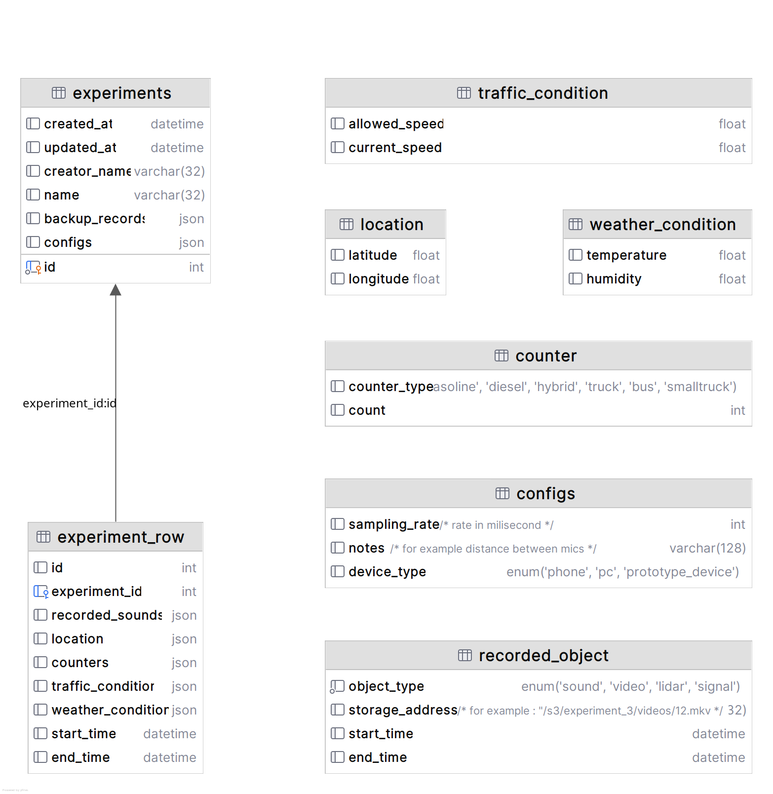

# Black Carbon Audio — Data Collection Dashboard

FastAPI-based dashboard to create “experiments”, capture short field recordings with location & context, and store them for later analysis. Ships with a web UI (Jinja2 + SB Admin assets), SQLite out of the box, and Docker/Docker Compose for easy deployment.

> After you run it, interactive API docs are at `http://127.0.0.1:8000/docs#/`.

---

## Features

* 📊 **Dashboard UI** listing experiments and a daily **recording-duration chart**.
* 🎙️ **In-browser audio capture** via Wavesurfer Record plugin.
* 🗺️ **Map preview** via Leaflet (on the “new row” page).
* 📝 Create **experiments** and append **rows** with:

  * audio file (WAV upload from the browser)
  * GPS coordinates
  * speed limits & current speed
  * temperature, humidity, wind speed
  * congestion level
  * counters (custom categorical counts)
* 💾 **Persistence** using SQLModel (SQLite default). MySQL stub present for future use.
* 🧱 Production-friendly Dockerfile and a Compose file (`infrastructure.yaml`).

---

## Project Structure

```
.
├── app.py                     # FastAPI app + routes & template rendering
├── entities.py                # SQLModel entities & Pydantic models/enums
├── dependency_injection.py    # DB engine/session wiring (SQLite default)
├── Dockerfile                 # Container build (Uvicorn + FastAPI)
├── infrastructure.yaml        # docker-compose file
├── requirements.txt           # Python deps
├── templates/                 # Jinja2 templates (dashboard, forms)
├── static/                    # CSS/JS/assets (SB Admin theme)
├── dev_db.db                  # Dev SQLite database (optional artifact)
└── configs.png                # Architecture diagram (reference)
```

---

## How it Works (High Level)

1. **Create an Experiment** (name, creator, sampling rate, sender type, comment).
2. **Open the Experiment** to add **Rows** (each row is one recording + context).
3. The browser uses **Wavesurfer Record** to capture audio and posts it along with a JSON payload.
4. The server stores the row in the DB and writes the audio file to disk.
5. The dashboard aggregates **total daily recording time** for the chart.

---

## Database Design (Class Diagram)

The following diagram illustrates the database entities and their relationships used by the dashboard.


 ---

## API Endpoints (main)

* `GET /`
  Render dashboard with experiment list and charts.

* `GET /experiment/new`
  Render dashboard (alt path).

* `POST /experiment/` → `Experiment`
  Create a new experiment.

* `GET /experiment/{experiment_id}`
  Render “New Row” screen for a given experiment (map, counters, recorder UI).

* `GET /experiments/all_duration`
  Return aggregated total seconds of recordings by day (for the chart).

* `POST /experiments/{experiment_id}/rows/` → `ExperimentRow`
  Upload an audio file + row JSON (see **Row Payload** below).
  Multipart fields:

  * `file`: WAV file recorded in the browser
  * `row_json`: stringified JSON with fields shown below

### Row Payload (JSON inside `row_json`)

```json
{
  "latitude": 51.5074,
  "longitude": -0.1278,
  "allowed_speed": 50,
  "current_speed": 42,
  "temperature": 18,
  "humidity": 60,
  "wind_speed": 4,
  "start_time": 1717432153000,
  "end_time": 1717432165000,
  "congestion_level": "LOW",
  "counters": { "cars": 12, "bikes": 3, "buses": 1 }
}
```

Notes:

* `start_time` / `end_time` are **epoch milliseconds** in the UI; the backend converts to `datetime`.
* Counters and congestion are enums/typed in `entities.py`. Adjust as needed.

---

## Data Model (summary)

* **Experiment**

  * `id`, `experiment_name`, `creator_name`
  * `sampling_rate`, `sender_type` (`pc|phone|hardware`)
  * `comment`
  * `create_at`, `update_at`
  * Relationship: `rows: List[ExperimentRow]`

* **ExperimentRow**

  * `id`, `experiment_id` (FK)
  * `latitude`, `longitude`
  * `allowed_speed`, `current_speed`
  * `temperature`, `humidity`, `wind_speed`
  * `start_time`, `end_time`
  * `congestion_level`
  * `counters` (JSON)
  * `record` (filesystem path to audio)

> See `entities.py` for exact field definitions and enums.

---

## Running with Docker (recommended)

### 1) Build & Run

```bash
docker compose -f infrastructure.yaml up --build
# Then open http://127.0.0.1:8000
```

### 2) Health & Docs

* Docs: `http://127.0.0.1:8000/docs`
* Health check used by Compose: `http://127.0.0.1:8000/docs` (adjust if you add `/health`).

---

## Local Development (without Docker)

```bash
python -m venv .venv && source .venv/bin/activate
pip install --upgrade pip -r requirements.txt
uvicorn app:app --host 0.0.0.0 --port 8000
```

---

## Configuration & Storage

### Database

* The app uses **SQLModel**. In `dependency_injection.py`, the engine is currently wired to **SQLite** (dev-friendly).
* A MySQL `connection_url` is scaffolded but **not active**. To switch:

  1. Provide a running MySQL instance and credentials.
  2. Replace the SQLite engine with `create_engine(connection_url, ...)`.
  3. Recreate tables or run migrations.
* `create_db_and_tables()` auto-creates tables at startup.

### Audio File Storage

* In `app.py`, audio is written via a **hardcoded base path** and stored under a `/static/sound/experiment_id:{id}-row:{row}.wav` subpath.
* **Action required** (recommended):

  * Create a writable directory inside the container/host, e.g. `./static/sound`.
  * Replace the hardcoded base path in `app.py` with an environment variable (e.g. `AUDIO_BASE_DIR`, default `./`), or set it to the project root.
  * Ensure the path exists and the container user has write permissions.

### Static Files

* Served at `/static` (see `app.mount("/static", ...)`).
* SB Admin theme and demo JS live under `static/`.

---

## Using the UI

1. Open `http://127.0.0.1:8000/`.
2. Click **Start Experiment** (or use the form if present) to create one.
3. Open an experiment to access the **New Row** page:

   * **Map** shows/accepts location.
   * **Counters** and **Congestion** can be set.
   * Click **Record** to capture audio from your microphone, then **Save** to upload.
4. Return to the dashboard to see the chart update as recordings accumulate.

---

## Example: Add a Row via `curl`

```bash
ROW_JSON='{
  "latitude": 51.5074,
  "longitude": -0.1278,
  "allowed_speed": 50,
  "current_speed": 42,
  "temperature": 18,
  "humidity": 60,
  "wind_speed": 4,
  "start_time": 1717432153000,
  "end_time": 1717432165000,
  "congestion_level": "LOW",
  "counters": {"cars": 12, "bikes": 3}
}'

curl -X POST "http://127.0.0.1:8000/experiments/1/rows/" \
  -F "row_json=${ROW_JSON}" \
  -F "file=@/path/to/audio.wav;type=audio/wav"
```

---


## Troubleshooting

* **Audio not saved**
  Ensure the storage path in `app.py` exists and is writable by the running user inside the container.

* **DB errors / missing tables**
  Confirm the engine configuration in `dependency_injection.py`. `create_db_and_tables()` runs at startup.

* **Docs/JS not loading**
  Check that `/static` is mounted correctly and assets are present.

---


## License

TBD
